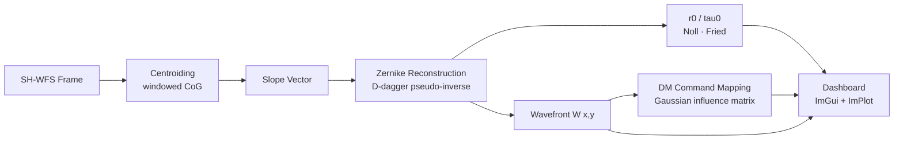

# 🛰️ AKASH-DARPAN
### आकाश दर्पण — *Sky Mirror*
**A**daptive **K**nowledge of **A**tmospheric **S**hack-**H**artmann — **D**ynamic **A**daptive **R**eal-time **P**rocessing **A**nd **N**econstruction Node

> Real-time Wavefront Reconstruction & Turbulence Characterisation System
> **ISRO Adaptive Optics Research Platform**

<p align="center">
  
  
  
  
  
  
</p>

<p align="center">
  <a href="#-what-it-does">What it does</a> •
  <a href="#-dashboard">Dashboard</a> •
  <a href="#-quick-start">Quick Start</a> •
  <a href="#-try-it-in-90-seconds">Try it in 90s</a> •
  <a href="#-pipeline-at-a-glance">Pipeline</a> •
  <a href="#-dependencies">Dependencies</a> •
  <a href="#-performance">Performance</a> •
  <a href="#-project-structure">Structure</a> •
  <a href="#-faq--troubleshooting">FAQ</a> •
  <a href="#-references">References</a>
</p>

---

## 🔭 What It Does

AKASH-DARPAN ingests time-series frames from a **Shack-Hartmann Wavefront Sensor (SH-WFS)** and, frame by frame, turns a grid of blurry spots into an actionable correction for a deformable mirror.

| Task | Algorithm |
|------|-----------|
| Locate spot centroids | Iterative windowed Centre-of-Gravity |
| Reconstruct wavefront `W(x,y)` | Zernike modal reconstruction (`D†` = pseudo-inverse) |
| Characterise turbulence | Fried `r₀` (Noll 1976), coherence time `τ₀` |
| Compute DM commands | Gaussian influence matrix, Fried geometry, coupling correction |
| Visualise everything | Dear ImGui + ImPlot mission-control dashboard |

All within a **< 5 ms processing budget** per frame — fast enough to sit inside a real adaptive-optics control loop.

<details>
<summary>🌀 <b>New to adaptive optics? Click for the 30-second version</b></summary>
<br>

Starlight (or a laser beacon) passes through turbulent atmosphere and arrives at the telescope with a **distorted wavefront** instead of a clean flat one. A Shack-Hartmann sensor splits the incoming light into a grid of tiny beams using a lenslet array; each beamlet lands on a detector as a spot. If the wavefront were perfectly flat, every spot would sit at its lenslet's optical centre. Turbulence shifts each spot slightly — and **the pattern of shifts *is* the wavefront**.

AKASH-DARPAN measures those shifts, reconstructs the wavefront in Zernike polynomial form, estimates how bad the turbulence is (`r₀`, `τ₀`), and computes the actuator commands a deformable mirror would need to cancel the distortion — all before the next frame arrives.
</details>

---

## 🖥️ Dashboard


<details>
<summary>📋 <b>What am I looking at? (panel-by-panel guide)</b></summary>
<br>

| Panel | Shows |
|---|---|
| **Spot Field** | Live SH-WFS frame with detected centroids overlaid |
| **Wavefront Map** | Reconstructed `W(x,y)` as a colour-mapped surface |
| **Zernike Bar Chart** | Coefficient amplitude per mode (tip/tilt, coma, astigmatism, …) |
| **r₀ / τ₀ Strip Chart** | Scrolling turbulence-strength history (ImPlot) |
| **DM Actuator Grid** | Commanded stroke per actuator, Fried geometry |
| **Timing HUD** | Per-stage latency breakdown vs. the 5 ms budget |

</details>

---

## ⚡ Quick Start

### Linux / macOS
```bash
git clone <repo> AKASH-DARPAN && cd AKASH-DARPAN
chmod +x setup_and_build.sh
./setup_and_build.sh          # installs deps, downloads libs, builds
./build/bin/akash_darpan      # runs with synthetic data
```

### With real SH-WFS frames
```bash
./build/bin/akash_darpan /path/to/bmp/frames/
```

### Generate test data
```bash
./build/bin/gen_synthetic_data ./data 200 0.12
# 200 frames, r₀ = 0.12 m (moderate turbulence)
./build/bin/akash_darpan ./data
```

### Windows
```bat
build_windows.bat
build\bin\Release\akash_darpan.exe
```

---

## 🚀 Try It in 90 Seconds

Want to see the whole pipeline react to *different sky conditions* without touching any code? Sweep the Fried parameter and watch the dashboard respond:

```bash
# Calm night, r₀ = 0.20 m — mild turbulence, small Zernike coefficients
./build/bin/gen_synthetic_data ./data_good 200 0.20
./build/bin/akash_darpan ./data_good

# Rough night, r₀ = 0.05 m — strong turbulence, actuators working hard
./build/bin/gen_synthetic_data ./data_bad 200 0.05
./build/bin/akash_darpan ./data_bad
```

**What to watch for:** as `r₀` drops, the spot field jitters more, the Zernike bar chart grows taller (higher-order modes appear), and the DM actuator grid lights up with larger commanded strokes — while the Timing HUD should stay flat under 5 ms regardless.

> 💡 Try feeding your own BMP frame sequence from a real SH-WFS — see [With real SH-WFS frames](#with-real-sh-wfs-frames) above.

---

## 🔗 Pipeline at a Glance



Each stage writes into the shared frame-state struct that the dashboard reads lock-free every render tick — so the visuals never stall the control loop, and the control loop never waits on the GPU.

---

## 📦 Dependencies

| Library | Purpose | Auto-fetched? |
|---------|---------|--------------|
| GLFW3 | Window + input | apt/brew/vcpkg |
| OpenGL 3.3 | GPU rendering | System |
| GLAD | OpenGL loader | `glad2` pip |
| Dear ImGui v1.90 | Dashboard UI | ✅ setup script |
| ImPlot | Scrolling graphs | ✅ setup script |
| stb_image.h | BMP/PNG loader | ✅ setup script |
| OpenMP | Parallel centroiding | System |

---

## 🗂️ Project Structure

```
AKASH-DARPAN/
├── CMakeLists.txt              ← Master build (see §4 docs)
├── setup_and_build.sh          ← One-shot Linux/macOS setup
├── build_windows.bat           ← MSVC + vcpkg build
├── include/                    ← All headers
├── src/                        ← All implementation files
├── shaders/                    ← GLSL 3.3 shaders
├── tools/gen_synthetic_data.cpp← Standalone BMP generator
└── docs/TECHNICAL_REFERENCE.md ← Full physics & API docs
```

---

## 📊 Performance

| Stage | Budget | Typical |
|-------|--------|---------|
| Image I/O (GL upload) | 0.5 ms | 0.1 ms |
| Centroiding (10×10 MLA) | 1.0 ms | 0.3 ms |
| Zernike Reconstruction | 2.0 ms | 0.8 ms |
| DM Actuator Mapping | 1.0 ms | 0.4 ms |
| **Total loop** | **< 5 ms** | **~1.6 ms** |
| Render | — | ~90 FPS |

```
Budget vs Typical (ms)
Image I/O   ██░░░░░░░░ 0.1 / 0.5
Centroiding ███░░░░░░░ 0.3 / 1.0
Zernike     ████░░░░░░ 0.8 / 2.0
DM Mapping  ████░░░░░░ 0.4 / 1.0
────────────────────────────────
Total       ███░░░░░░░ 1.6 / 5.0  ✅ 3.4 ms of headroom
```

---

## ❓ FAQ & Troubleshooting

<details>
<summary><b>The build fails looking for GLFW/OpenGL headers</b></summary>
<br>
Install the system packages before running the setup script:

```bash
# Debian/Ubuntu
sudo apt install libglfw3-dev libgl1-mesa-dev

# macOS
brew install glfw
```
</details>

<details>
<summary><b>Can I feed it live camera frames instead of a folder of BMPs?</b></summary>
<br>
Not out of the box — the current input path expects a directory of pre-captured BMP frames. See <code>docs/TECHNICAL_REFERENCE.md</code> for the frame-source interface if you want to wire in a live camera SDK.
</details>

<details>
<summary><b>How do I change the lenslet array (MLA) geometry?</b></summary>
<br>
MLA grid size, pitch, and search-window radius are configured in the centroiding module — see §2 of <code>docs/TECHNICAL_REFERENCE.md</code> for the parameter list and defaults (10×10 is the shipped example).
</details>

<details>
<summary><b>The Timing HUD shows red / over-budget</b></summary>
<br>
Confirm OpenMP is actually enabled at build time (check your CMake configure log for <code>OpenMP found</code>) — centroiding is the stage most sensitive to thread count.
</details>

---

## 📚 References

- Noll, R.J. (1976) — *Zernike polynomials and atmospheric turbulence*
- Fried, D.L. (1965) — *Fried parameter r₀*
- Roddier, F. (1999) — *Adaptive Optics in Astronomy*
- Hardy, J.W. (1998) — *Adaptive Optics for Astronomical Telescopes*

---

<p align="center"><i>Built for real-time skies. 🌌</i></p>
